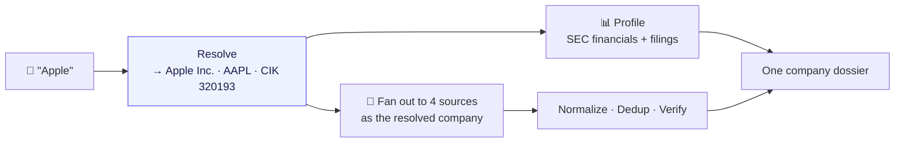
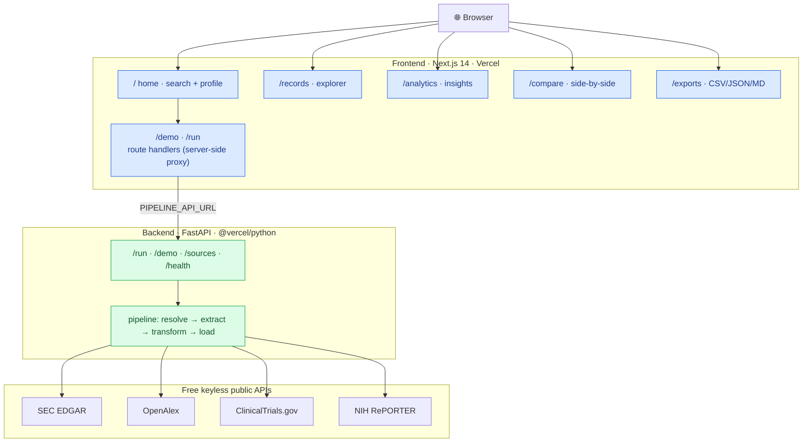
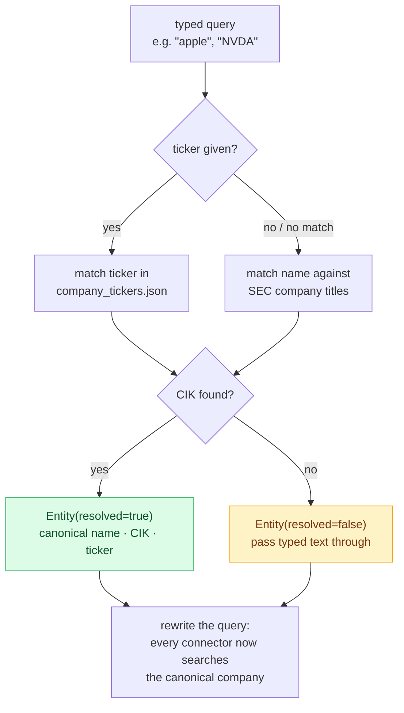
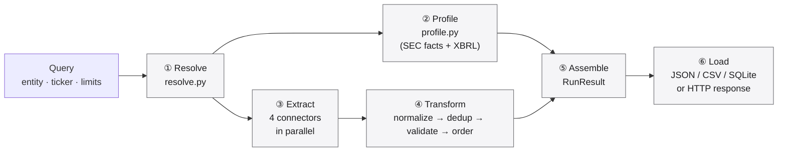
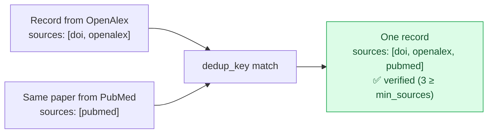
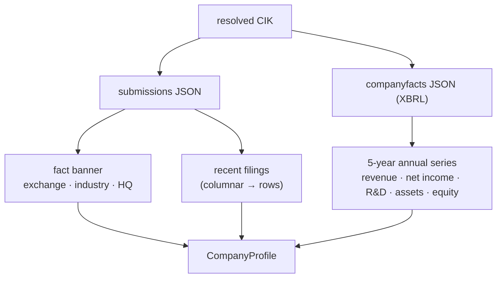
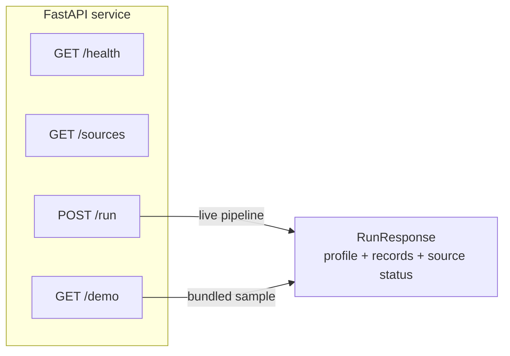
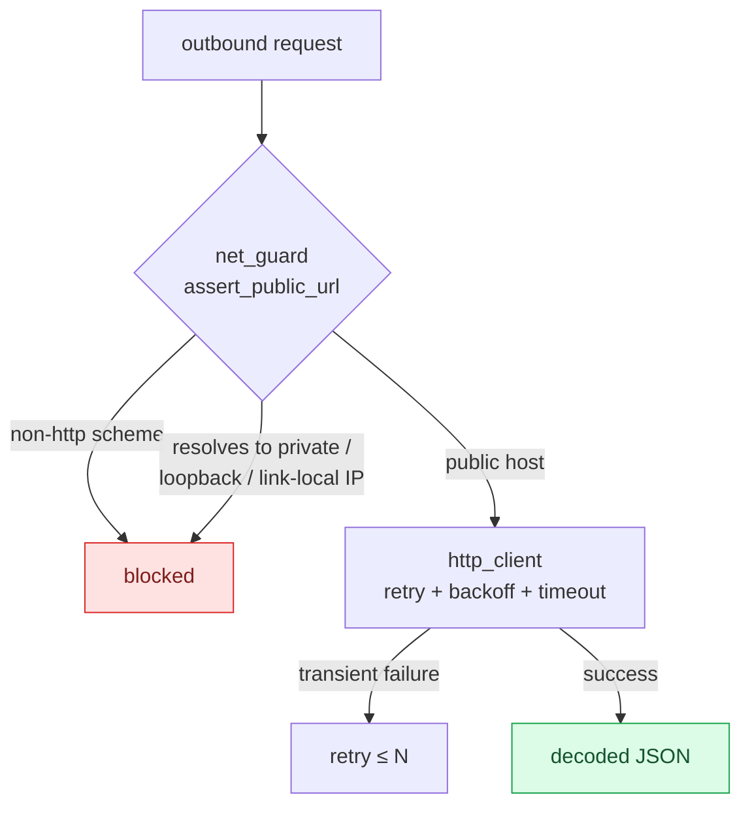
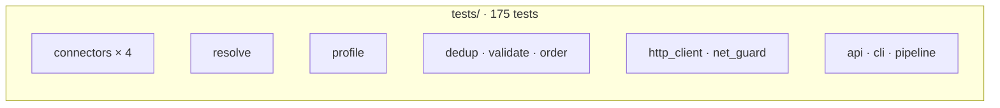
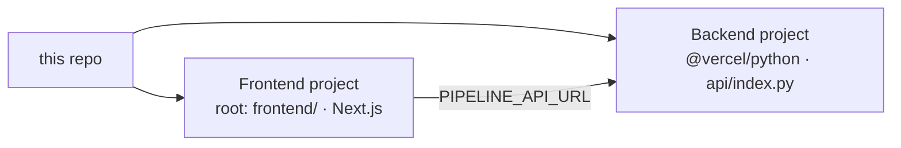

# Dossier

**Type a company. Get its filings, financials, research, trials, and grants — one sourced profile, in seconds.**

Dossier compiles an intelligence profile of any public company from four **free, keyless, primary** government and research APIs. It resolves the company once, queries every source *as that company*, then normalizes, deduplicates, and provenance-checks every record — and attaches five years of the company's own SEC financials on top.

**Live:** [groundtruth-2uhy-one.vercel.app](https://groundtruth-2uhy-one.vercel.app) · **API:** [dossier-api-kappa.vercel.app](https://dossier-api-kappa.vercel.app/health)

> **The rule behind every choice: the app is free to run.** No language model in the request path. No API keys. No cost per query. Every number, filing, and citation comes from a public primary source.

> **Disclaimer.** Independent project. For information only — not investment advice. All data belongs to its source agency.

---

## Table of contents

1. [What it does](#what-it-does)
2. [Why it's hard](#why-its-hard)
3. [System architecture](#system-architecture)
4. [Entity resolution — the core idea](#entity-resolution--the-core-idea)
5. [The ETL pipeline](#the-etl-pipeline)
6. [Company Profile engine](#company-profile-engine)
7. [Data sources](#data-sources)
8. [The frontend](#the-frontend)
9. [HTTP API](#http-api)
10. [Reliability & security](#reliability--security)
11. [Testing](#testing)
12. [Repository layout](#repository-layout)
13. [Local development](#local-development)
14. [Deployment](#deployment)
15. [Design decisions](#design-decisions)
16. [Limitations](#limitations)
17. [License](#license)

---

## What it does

You type `Apple`. Dossier returns:

| Section | Source | Example |
|---|---|---|
| **Fact banner** | SEC submissions | `Apple Inc. · AAPL · Nasdaq · Electronic Computers · Cupertino, CA` |
| **Financials** | SEC XBRL company facts | 5-year revenue, net income, R&D, assets, equity — with charts |
| **Filings** | SEC EDGAR | recent 10-K / 10-Q / 8-K, each linking into the archive |
| **Research** | OpenAlex | papers authored *at the company*, by institution not keyword |
| **Trials** | ClinicalTrials.gov | studies it sponsors, with phase and status |
| **Grants** | NIH RePORTER | federally funded work that names it |

Every record is normalized to one shape, deduplicated across sources, and tagged with the provenance URLs that attest to it.



---

## Why it's hard

The naive version of this app is a keyword search fanned out to four APIs. It fails immediately, and the failure is instructive:

- Search **"Apple"** on OpenAlex → *apple orchard horticulture*, because "apple" is a fruit.
- Search **"Target"** on PubMed → *target-organ toxicology*, because "target" is a common noun.
- Search **"Shell"** → *seashell biology* and *combustion shells*.
- Ask SEC EDGAR for filings **without a ticker** → nothing, because EDGAR is keyed on CIK.

A company name is ambiguous; a keyword has no idea a company was meant. **The entire design turns on resolving the company to a stable identity first**, then querying each source under that identity — a CIK for the SEC, an institution ID for OpenAlex, the canonical legal name everywhere else. That resolution stage is what separates a demo from a product.

---

## System architecture

Two services, both on Vercel's free tier, talking over one environment variable.



- **Frontend** (`frontend/`) — Next.js App Router. The `/demo` and `/run` route handlers proxy to the backend **server-side**, so the browser never calls the API directly and no CORS setup is needed. With no backend configured, the same routes serve bundled sample data and every page says so plainly.
- **Backend** (`src/etl_pipeline/`) — a modular ETL pipeline (Python standard library only) behind a thin FastAPI service. The connectors know nothing about each other; the core knows nothing about any specific API. Adding a fifth source is a one-line change to the registry.

---

## Entity resolution — the core idea

Before a single record is fetched, the typed query becomes a known company identity. This is `src/etl_pipeline/resolve.py`.



**Name matching is deliberate.** `normalize_company()` strips legal-form suffixes (`Inc.`, `Corp`, `Co`, `Holdings`, …) so `Apple` matches `Apple Inc.`. An **exact** normalized title beats a **prefix** match, so `Apple` resolves to *Apple Inc.* — not *Apple Hospitality REIT*. An explicit ticker always wins over the name, because a ticker is unambiguous.

**Failure is never fatal.** A private company, a foreign issuer, or an unreachable EDGAR all fall through to `resolved=false`, and the pipeline runs on the typed string exactly as it did before resolution existed. Nothing that isn't in EDGAR breaks.

**OpenAlex resolves too.** Because "apple" the keyword is hopeless, the OpenAlex connector resolves the company to an **institution ID** and does an authorship lookup instead. A company entity beats a same-named university; the most-published entity wins, so a parent company outranks its national subsidiaries. When OpenAlex has no institution for a company, it degrades to affiliation-string matching rather than returning nothing.

---

## The ETL pipeline

`src/etl_pipeline/core/pipeline.py` is the single entry point. A fetcher can be injected, so the whole pipeline runs offline under test.



| Stage | Module | What it does |
|---|---|---|
| **Resolve** | `resolve.py` | typed query → canonical company identity (CIK, ticker, name) |
| **Profile** | `profile.py` | SEC fact banner + 5-year XBRL financial series + recent filings |
| **Extract** | `core/extract.py` | each connector queries its own endpoint in a `ThreadPoolExecutor`; a failed source is recorded, not fatal |
| **Transform** | `transform/` | one record shape → deduplicate (merging provenance) → validate (reputability + `min_sources`) → deterministic order |
| **Load** | `load/` | emit JSON, CSV, or SQLite — or return over HTTP |

### Deduplication merges provenance

Records that match on normalized title and identifier are collapsed into one, and their provenance URL lists are **unioned**. This is why a record can end up attested by more sources than the single connector that surfaced it — and why the "verified" badge means something.



---

## Company Profile engine

`src/etl_pipeline/profile.py` reads two keyless SEC endpoints and turns them into the numbers a person can actually use. **No figure is modelled or projected — every value is the company's own reported XBRL data.**



Two problems make this harder than it looks, and both are solved:

**1. Fiscal years must come from the *period*, not the filing.** XBRL's `fy` field is the fiscal year of the *filing* — so a 10-K's prior-year comparatives all carry the newer filing's `fy` and would overwrite the real figure for that year. Dossier keys every value on its own period **end date**, and keeps only ~52-week durations, so quarters and multi-year cumulatives can never enter an annual series.

**2. Concepts must be merged.** Companies change which XBRL concept they report revenue under. Taking the first tag that has data would end NVIDIA's revenue series the year it switched concepts. Dossier merges across a metric's candidate tags (specific concepts first), producing one continuous series, and clips **all** metrics to a single shared year window — so a net margin is never computed across two different fiscal years.

The result, verified live against the companies' own filings:

| Company | Latest revenue | Net margin | 5-yr series |
|---|---|---|---|
| Apple | $416B | 27% | ✅ |
| NVIDIA | $215.9B | 56% | ✅ |
| Tesla | $95B | 4% | ✅ |
| Pfizer | $63B | 12% | ✅ |

---

## Data sources

All free. All primary source. No API keys.

| Source | Provides | Endpoint |
|---|---|---|
| **SEC ticker DB** | name / ticker → CIK | `sec.gov/files/company_tickers.json` |
| **SEC submissions** | HQ, industry, exchange, filing history | `data.sec.gov/submissions/` |
| **SEC company facts** | multi-year XBRL financials | `data.sec.gov/api/xbrl/companyfacts/` |
| **SEC EDGAR** | 10-K / 10-Q / 8-K filings | `data.sec.gov` · `sec.gov/Archives` |
| **OpenAlex** | research works, by institution | `api.openalex.org` |
| **ClinicalTrials.gov v2** | sponsor-matched trials, phases | `clinicaltrials.gov/api/v2/studies` |
| **NIH RePORTER** | federally funded grants + PIs | `api.reporter.nih.gov/v2/projects/search` |

---

## The frontend

A Next.js App Router workspace. One shared run store (mirrored into `sessionStorage`) means a dossier loaded on one route survives navigation and refresh.

| Route | What it is |
|---|---|
| `/` | **Home** — hero, search, and the full company profile (fact banner, financial charts, filings, records). Before a search: a sample-output card and an explainer. |
| `/records` | **Explorer** — every record, filterable by source / type / verification, searchable, sortable, list or dense table. |
| `/analytics` | **Insights** — distribution by source, type, year, and provenance depth; a source × type matrix. |
| `/compare` | **Compare** — up to four companies side by side, by what each actually produces. |
| `/exports` | **Export** — CSV, JSON, or Markdown, built in-browser from the loaded run. |
| `/sources` | **Sources** — per-connector health, coverage, and how verification works. |
| `/pipeline` | **How it works** — the architecture, plus a live probe of this deployment's backend. |

Charts are **hand-built, dependency-free SVG** (`components/Charts.tsx`) — a multi-series line chart and a vertical bar chart, reading the same CSS variables as the rest of the app. Nothing to ship, theme, or keep in sync. The design system is a single Apple-style token layer: system grays, system blue, one radius / shadow / motion scale.

---

## HTTP API



| Method | Path | Returns |
|---|---|---|
| `GET` | `/health` | service status and version |
| `GET` | `/sources` | the registered connector names |
| `POST` | `/run` | a live pipeline run for one entity |
| `GET` | `/demo` | a pre-baked result, no network required |

```bash
curl -X POST https://dossier-api-kappa.vercel.app/run \
  -H "Content-Type: application/json" \
  -d '{"entity": "Apple", "max_results": 10}'
```

```jsonc
{
  "entity": "Apple",
  "resolved": true,
  "cik": "0000320193",
  "ticker": "AAPL",
  "profile": {
    "name": "Apple Inc.", "exchange": "Nasdaq", "industry": "Electronic Computers",
    "financials": { "revenue": { "2025": 416160000000 }, "net_income": { "2025": 112010000000 } },
    "filings": [ { "form": "10-K", "filed": "2024-11-01", "url": "https://www.sec.gov/..." } ]
  },
  "count": 18,
  "records": [ /* normalized, deduplicated, provenance-tagged */ ],
  "sources": [ { "source": "sec_edgar", "ok": true, "count": 4 } ]
}
```

---

## Reliability & security

The keyless, primary-source design shapes the threat model: there are no paid keys to leak and no model in the path. What remains is hardened.



- **SSRF guard** (`net_guard.py`) — every connector targets a fixed public API, but a redirect could still point at a private, loopback, or link-local address (e.g. the cloud metadata endpoint at `169.254.169.254`). `assert_public_url` rejects non-`http(s)` schemes and any host that resolves to a non-public IP.
- **Resilient HTTP** (`http_client.py`) — a shared client with per-request timeouts and transient-failure retries with backoff. One flaky API slows a run; it never kills it.
- **Graceful degradation** — a connector that raises is recorded as a *failed source* with its error, and the rest of the dossier is built without it. The UI shows exactly which sources responded.
- **Source reputability** (`transform/validate.py`) — a record is marked *verified* only when it carries at least `min_sources` distinct provenance URLs from reputable hosts (matched by hostname suffix, not substring, so `evil-sec.gov.attacker.com` never passes as `sec.gov`).
- **Honest data mode** — the `/run` proxy stamps an `x-dossier-mode` header (`live` vs `demo`); a configured-but-unreachable backend returns 502 rather than silently serving samples as a real run.

---

## Testing

**175 tests, passing on Python 3.10 / 3.11 / 3.12 in CI.** The pipeline is pure standard library, so the suite runs offline and deterministically — every connector is driven by an injected fetcher over recorded fixtures.

```bash
pytest                      # full suite
pytest tests/test_resolve.py -v   # e.g. entity resolution
```

Coverage spans every connector, the resolver, the profile engine (fiscal-year alignment, concept merging, restatements), dedup, validation, the HTTP client, the SSRF guard, the API, and the CLI.



---

## Repository layout

```
src/etl_pipeline/
  resolve.py            entity resolution — typed query → company identity
  profile.py            SEC fact banner + XBRL financials + filings
  registry.py           connector registry (add a source in one line)
  models.py             Query, Record, RunResult, SourceResult
  http_client.py        retrying, timeout-bounded JSON fetcher
  net_guard.py          SSRF guard (assert_public_url)
  text.py  config.py    parsing helpers, tunable defaults
  cli.py                `dossier --entity Apple --formats json csv`
  connectors/           sec_edgar · openalex · clinicaltrials · nih_reporter
  core/                 extract (concurrent) · transform · load · pipeline
  transform/            dedup · validate · order
  load/                 json · csv · sqlite writers
  api/                  app · schemas · service (FastAPI)

frontend/
  app/                  home + records · analytics · compare · exports ·
                        sources · pipeline, plus /demo & /run route handlers
  components/           Charts (SVG) · Profile · AppShell (nav) · ui
  lib/                  api · store (shared run state) · resolve-aware types ·
                        sources · analytics · exports · format

api/index.py            Vercel @vercel/python entry point (re-exports FastAPI)
vercel.json             serverless function config
tests/                  23 modules, one per source module + fixtures
.github/workflows/      CI on Python 3.10–3.12
```

**Tech stack:** Next.js 14 · React 18 · TypeScript 5 · FastAPI · Python 3 (stdlib pipeline) · Vercel (both runtimes).

---

## Local development

```bash
# backend — the pipeline is pure stdlib; FastAPI only for the HTTP service
pip install -e ".[dev]"
uvicorn etl_pipeline.api.app:app --reload      # http://localhost:8000/health

# frontend — works standalone on bundled data with no backend
cd frontend
npm install
echo 'PIPELINE_API_URL=http://localhost:8000' > .env.local
npm run dev                                    # http://localhost:3000
```

Or run the pipeline straight from the command line, no server:

```bash
dossier --entity "NVIDIA" --formats json csv --out ./out
```

---

## Deployment

Two Vercel projects, both free tier.



1. Deploy the backend — the repo ships `api/index.py` + `vercel.json` for the `@vercel/python` runtime.
2. Set `PIPELINE_API_URL` on the frontend project to the backend's URL. The `/run` route proxies to it server-side, so **no CORS configuration is needed**.
3. Visit `/pipeline` on the deployed site — it probes the backend's `/health` on every load and reports *Connected to a live backend*, *configured but unreachable*, or *running standalone*.

`PIPELINE_API_URL`, not `NEXT_PUBLIC_API_URL`: the former is read server-side and needs no CORS; the latter points the browser straight at the API and only works if the backend allows the origin.

---

## Design decisions

- **Resolve first, fetch second.** The one decision the whole product turns on. A keyword search across four APIs returns noise; a resolved identity returns a company.
- **No language model, anywhere.** Every number is the company's own reported figure; every narrative field is the source agency's own text. The app costs nothing to run and can't hallucinate.
- **Standard library only.** The pipeline has zero runtime dependencies — no requests, no pandas. It is trivially portable, instant to install, and impossible to break with a supply-chain update. FastAPI is pulled in only by the HTTP service.
- **The connectors are ignorant of each other.** The core dispatches through a registry; a connector is one module implementing one `fetch()`. A fifth source is a one-line registry change and a new module.
- **Degrade, never fail.** A dead API is a missing section, not a 500. The dossier is always as complete as the sources that responded, and the UI is honest about which those were.

---

## Limitations

These follow from the no-paid-APIs, no-model rule, and the UI is honest about them:

- Companies with no SEC registration (private firms, foreign issuers, research institutes) get a lighter profile — records but no financial banner.
- A company whose name is also a common noun (`Target`, `Shell`) resolves correctly against SEC, but for sources with no entity model the research match can still be loose. The SEC-resolved path is the reliable one.
- Financials are the company's own reported figures, not original analysis — the one thing a model would add, deliberately left out.
- Rate limiting is not implemented on the public endpoints; the intended deployment is a personal/free-tier project.

---

## License

MIT. See [LICENSE](LICENSE).

Data: U.S. SEC EDGAR, OpenAlex, ClinicalTrials.gov, NIH RePORTER. For information only. Not investment advice.
