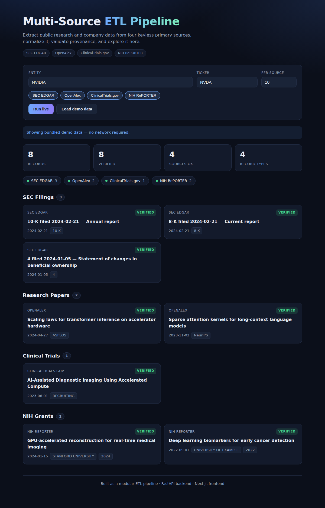

# multi-source-etl-pipeline

A full-stack application that extracts public research and company data from
four **free, keyless, primary** sources, normalizes every row to a single
record shape, validates its provenance, and presents it in a live dashboard.

- **Backend** — a modular ETL pipeline (pure Python standard library) plus a
  FastAPI service. 148 tests, ~98% coverage, CI on Python 3.10–3.12.
- **Frontend** — a Next.js + TypeScript dashboard that runs the pipeline and
  explores the results.



## Sources

| Source | Record type | Provides |
|---|---|---|
| **SEC EDGAR** | `filing` | Company filings resolved from a stock ticker (10-K, 8-K, Form 4, …) |
| **OpenAlex** | `paper` | Research works whose author affiliations mention the entity |
| **ClinicalTrials.gov** | `trial` | Trials sponsored by the entity |
| **NIH RePORTER** | `grant` | Federal grants that mention the entity |

All four are queried concurrently. No API keys, no paid services, no
third-party runtime dependencies in the pipeline core.

## Architecture

```
                 ┌─────────────────────────────────────────────┐
   Next.js UI ──▶│ FastAPI  /run  /demo  /sources  /health      │
   (frontend)    └───────────────┬─────────────────────────────┘
                                 │
                     ┌───────────▼───────────┐
                     │  pipeline.run()        │
                     │                        │
   extract ─────────▶│  4 connectors (async)  │  one failure never aborts a run
   transform ───────▶│  dedup ▸ verify ▸ order │
   load ────────────▶│  json ▸ csv ▸ sqlite    │
                     └────────────────────────┘
```

The pipeline is testable in isolation: network access lives in exactly one
module (`http_client`) and reaches connectors as an injected fetcher, so the
entire test suite runs offline against captured fixtures.

## Quick start

### Everything at once (Docker)

```bash
docker compose up --build
# open http://localhost:3000
```

### Or run the two halves directly

Backend:

```bash
pip install -e ".[dev]"
uvicorn etl_pipeline.api.app:app --reload      # http://localhost:8000
```

Frontend:

```bash
cd frontend
npm install
npm run dev                                     # http://localhost:3000
```

The UI loads bundled **demo data** on first paint (via `/demo`), so it renders
immediately with no network. Press **Run live** to hit the real APIs through
the backend.

## Command-line use

The pipeline is also a standalone CLI, independent of the API and frontend:

```bash
msetl --entity "NVIDIA" --ticker NVDA --out ./out
# writes nvidia.json, nvidia.csv, nvidia.sqlite
```

```
--sources        comma-separated subset (default: all)
--formats        subset of json,csv,sqlite (default: all)
--max-results    records per source (default: 10)
--min-sources    reputable sources needed to verify a record (default: 1)
--sequential     fetch one source at a time instead of concurrently
```

## Library use

```python
from etl_pipeline.core.pipeline import run
from etl_pipeline.models import Query

result = run(Query(entity="NVIDIA", ticker="NVDA"), out_dir="./out")
print(len(result.records), "records", result.outputs)
```

## HTTP API

| Method | Path | Purpose |
|---|---|---|
| `GET`  | `/health`  | liveness + version |
| `GET`  | `/sources` | list available source names |
| `POST` | `/run`     | run the pipeline live for an entity |
| `GET`  | `/demo`    | pre-baked result so the UI works with no network |

```bash
curl -X POST localhost:8000/run \
  -H 'content-type: application/json' \
  -d '{"entity":"NVIDIA","ticker":"NVDA","max_results":5}'
```

### Provenance rule

A source URL only counts when it is well-formed (an `http(s)` URL with a
host), reputable (a `.gov`/`.edu` host, a recognized primary research host, or
the subject's own domain — aggregators like Wikipedia and Crunchbase are
rejected), and distinct (the same URL twice is one source). A record is marked
`verified` once it carries at least `min_sources` such sources; deduplication
unions provenance across sources, so a record corroborated by two sources
clears a stricter bar naturally.

## Testing

```bash
pytest                       # 148 tests, fully offline
pytest --cov=etl_pipeline    # with coverage
cd frontend && npm run build # type-checks and builds the frontend
```

## Deploy

- **Backend** → Render (`render.yaml`, Docker) or any container host. It reads
  `$PORT`.
- **Frontend** → Vercel (`frontend/vercel.json`). Set `NEXT_PUBLIC_API_URL` to
  the deployed backend URL.

## Project layout

```
src/etl_pipeline/
  models.py  config.py  text.py  net_guard.py  http_client.py  registry.py  cli.py
  connectors/   sec_edgar, openalex, clinicaltrials, nih_reporter
  transform/    validate, dedup, order
  load/         json_loader, csv_loader, sqlite_loader, rows
  core/         extract, transform, load, pipeline
  api/          app, schemas, service (FastAPI)
frontend/
  app/          layout, page, globals.css
  components/   SearchForm, ResultsDashboard, RecordCard, StatCards, SourceStatusBar
  lib/          api, types, format
tests/          one module per source module, plus fixtures/
Dockerfile  frontend/Dockerfile  docker-compose.yml  render.yaml  frontend/vercel.json
```

See [docs/STYLE.md](docs/STYLE.md) for the code conventions every module follows.

## License

MIT — see [LICENSE](LICENSE).
