# Dossier

**Type a company. Get its filings, financials, research, trials, and grants - one sourced profile, in seconds. Type an industry and get the same for every company in it. Name a company and a university and get their real, documented links.**

Dossier is a full-stack intelligence workspace built on four **free, keyless, primary** government and research APIs. Its core engine resolves a company once, queries every source *as that company*, then normalizes, deduplicates, and provenance-checks every record - and attaches five years of the company's own SEC financials on top. Three more engines compose that core: a **Sector Scan** that profiles a whole industry concurrently and streams progress live, **Partnership Intelligence** that finds sourced links between any company and any research institution, and a deterministic **Talking Points** generator that turns the evidence into a ranked outreach list. A **Company Directory** covers every SEC-listed company, and **Projects** saves any finished run for instant reopening.

**Live:** [groundtruth-2uhy-one.vercel.app](https://groundtruth-2uhy-one.vercel.app) · **API:** [dossier-api-kappa.vercel.app](https://dossier-api-kappa.vercel.app/health)

> **The rule behind every choice: the app is free to run.** No language model in the request path. No API keys. No cost per query. Every number, filing, and citation comes from a public primary source.

> **Disclaimer.** Independent project. For information only - not investment advice. All data belongs to its source agency.

---

## Table of contents

1. [What it does](#what-it-does)
2. [Why it's hard](#why-its-hard)
3. [System architecture](#system-architecture)
4. [Entity resolution - the core idea](#entity-resolution--the-core-idea)
5. [The ETL pipeline](#the-etl-pipeline)
6. [Company Profile engine](#company-profile-engine)
7. [Data sources](#data-sources)
8. [The frontend](#the-frontend)
9. [HTTP API](#http-api)
10. [Reliability & security](#reliability--security)
11. [Testing](#testing)
12. [Repository layout](#repository-layout)
13. [Local development](#local-development)
14. [Deployment](#deployment)
15. [Design decisions](#design-decisions)
16. [Limitations](#limitations)
17. [License](#license)

---

## What it does

You type `Apple`. Dossier returns:

| Section | Source | Example |
|---|---|---|
| **Fact banner** | SEC submissions | `Apple Inc. · AAPL · Nasdaq · Electronic Computers · Cupertino, CA` |
| **Financials** | SEC XBRL company facts | 5-year revenue, net income, R&D, assets, equity - with charts |
| **Filings** | SEC EDGAR | recent 10-K / 10-Q / 8-K, each linking into the archive |
| **Research** | OpenAlex | papers authored *at the company*, by institution not keyword |
| **Trials** | ClinicalTrials.gov | studies it sponsors, with phase and status |
| **Grants** | NIH RePORTER | federally funded work that names it |

Every record is normalized to one shape, deduplicated across sources, and tagged with the provenance URLs that attest to it.

And that single-company pipeline is only the first engine. The workspace nav exposes four more surfaces built on top of it:

| Engine | Route | What it does |
|---|---|---|
| **Sector Scan** | `/sectors` | Type an industry. Membership resolves three ways (curated seeds → live EDGAR full-text discovery → default set, never empty), then the full pipeline runs for every company on a budgeted worker pool while progress streams to the browser as server-sent events. The report ends with aggregate verification stats and a numbered reference list. |
| **Partnership Intelligence** | `/partnerships` | Name a company and any research institution ("NVDA" + "UNC"). Four concurrent lookups find co-authored papers (a real OpenAlex affiliation intersection, not a text search), trials naming the institution, funded projects whose text names the company, and the company's own filings mentioning the institution. Rule-based detection ranks confirmed signals over probable ones. |
| **Talking Points** | (in the partnership view) | Deterministic template assembly over the evidence: confirmed relationships first, then funded researchers to contact, joint trials, and co-authorship openings. At most eight points, never empty, no model anywhere. |
| **Directory** | `/directory` | Every SEC-listed company from the SEC's own exchange-annotated file: server-side search, exchange filter, sort, paging, and CSV export. Any row opens as a full dossier. |
| **Projects** | `/projects` | Save any finished run under a name; reopening renders it from the saved payload with no re-fetch. localStorage in the browser, plus a SQLite-backed `/projects` API server-side. |

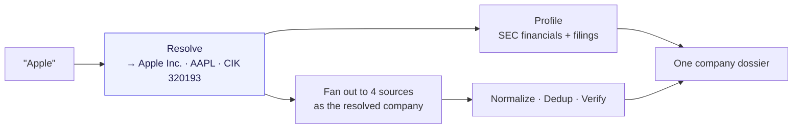

---

## Why it's hard

The naive version of this app is a keyword search fanned out to four APIs. It fails immediately, and the failure is instructive:

- Search **"Apple"** on OpenAlex → *apple orchard horticulture*, because "apple" is a fruit.
- Search **"Target"** on PubMed → *target-organ toxicology*, because "target" is a common noun.
- Search **"Shell"** → *seashell biology* and *combustion shells*.
- Ask SEC EDGAR for filings **without a ticker** → nothing, because EDGAR is keyed on CIK.

A company name is ambiguous; a keyword has no idea a company was meant. **The entire design turns on resolving the company to a stable identity first**, then querying each source under that identity - a CIK for the SEC, an institution ID for OpenAlex, the canonical legal name everywhere else. That resolution stage is what separates a demo from a product.

---

## System architecture

Two services, both on Vercel's free tier, talking over one environment variable.

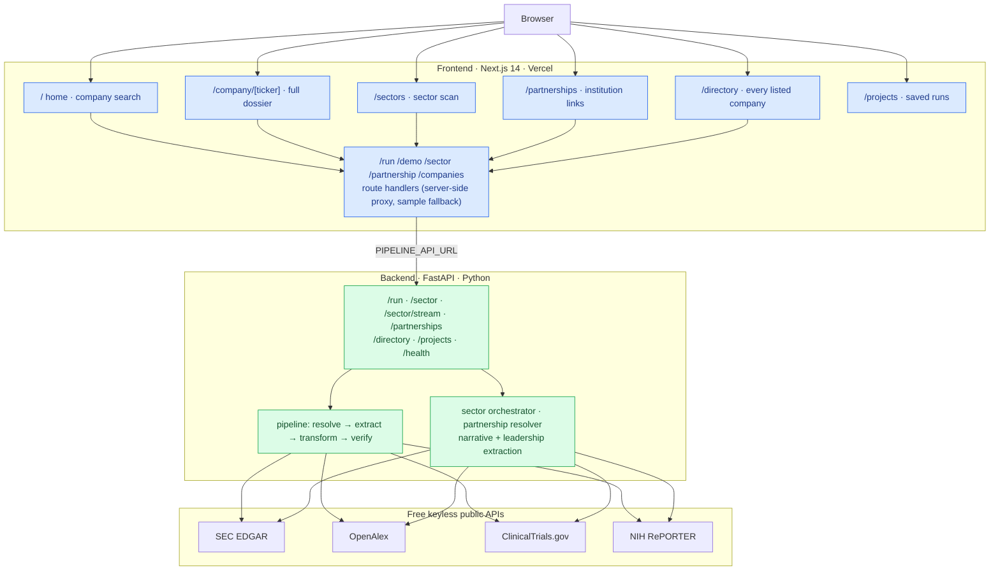

### Pages and what each one does

Every page is a working feature, not a shell. A ticker clicked in the sector
report opens that company's dossier; a directory row does the same; a saved
project rehydrates its engine with no re-fetch.

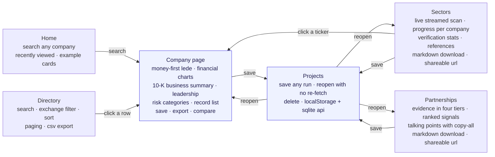

- **Frontend** (`frontend/`) - Next.js App Router. The `/demo` and `/run` route handlers proxy to the backend **server-side**, so the browser never calls the API directly and no CORS setup is needed. With no backend configured, the same routes serve bundled sample data and every page says so plainly.
- **Backend** (`src/etl_pipeline/`) - a modular ETL pipeline (Python standard library only) behind a thin FastAPI service. The connectors know nothing about each other; the core knows nothing about any specific API. Adding a fifth source is a one-line change to the registry.

---

## Entity resolution - the core idea

Before a single record is fetched, the typed query becomes a known company identity. This is `src/etl_pipeline/resolve.py`.

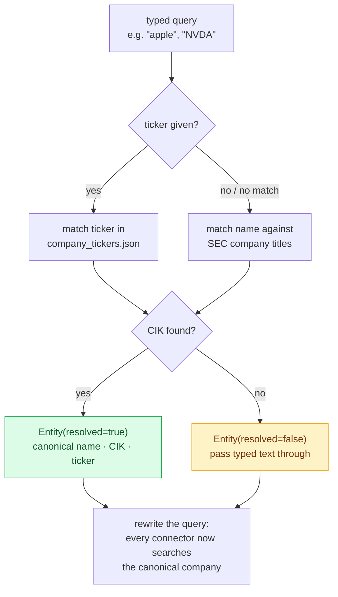

**Name matching is deliberate.** `normalize_company()` strips legal-form suffixes (`Inc.`, `Corp`, `Co`, `Holdings`, …) so `Apple` matches `Apple Inc.`. An **exact** normalized title beats a **prefix** match, so `Apple` resolves to *Apple Inc.* - not *Apple Hospitality REIT*. An explicit ticker always wins over the name, because a ticker is unambiguous.

**Failure is never fatal.** A private company, a foreign issuer, or an unreachable EDGAR all fall through to `resolved=false`, and the pipeline runs on the typed string exactly as it did before resolution existed. Nothing that isn't in EDGAR breaks.

**OpenAlex resolves too.** Because "apple" the keyword is hopeless, the OpenAlex connector resolves the company to an **institution ID** and does an authorship lookup instead. A company entity beats a same-named university; the most-published entity wins, so a parent company outranks its national subsidiaries. When OpenAlex has no institution for a company, it degrades to affiliation-string matching rather than returning nothing.

---

## The ETL pipeline

`src/etl_pipeline/core/pipeline.py` is the single entry point. A fetcher can be injected, so the whole pipeline runs offline under test.

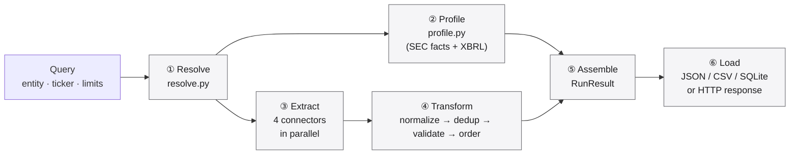

| Stage | Module | What it does |
|---|---|---|
| **Resolve** | `resolve.py` | typed query → canonical company identity (CIK, ticker, name) |
| **Profile** | `profile.py` | SEC fact banner + 5-year XBRL financial series + recent filings |
| **Extract** | `core/extract.py` | each connector queries its own endpoint in a `ThreadPoolExecutor`; a failed source is recorded, not fatal |
| **Transform** | `transform/` | one record shape → deduplicate (merging provenance) → validate (reputability + `min_sources`) → deterministic order |
| **Load** | `load/` | emit JSON, CSV, or SQLite - or return over HTTP |

### Deduplication merges provenance

Records that match on normalized title and identifier are collapsed into one, and their provenance URL lists are **unioned**. This is why a record can end up attested by more sources than the single connector that surfaced it - and why the "verified" badge means something.

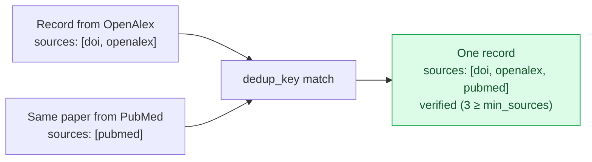

---

## Company Profile engine

`src/etl_pipeline/profile.py` reads two keyless SEC endpoints and turns them into the numbers a person can actually use. **No figure is modelled or projected - every value is the company's own reported XBRL data.**

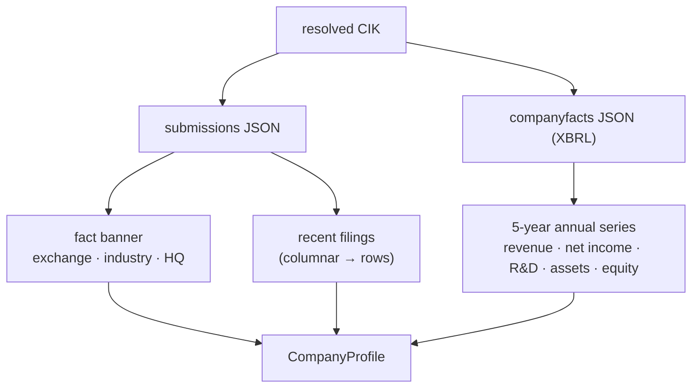

Two problems make this harder than it looks, and both are solved:

**1. Fiscal years must come from the *period*, not the filing.** XBRL's `fy` field is the fiscal year of the *filing* - so a 10-K's prior-year comparatives all carry the newer filing's `fy` and would overwrite the real figure for that year. Dossier keys every value on its own period **end date**, and keeps only ~52-week durations, so quarters and multi-year cumulatives can never enter an annual series.

**2. Concepts must be merged.** Companies change which XBRL concept they report revenue under. Taking the first tag that has data would end NVIDIA's revenue series the year it switched concepts. Dossier merges across a metric's candidate tags (specific concepts first), producing one continuous series, and clips **all** metrics to a single shared year window - so a net margin is never computed across two different fiscal years.

The result, verified live against the companies' own filings:

| Company | Latest revenue | Net margin | 5-yr series |
|---|---|---|---|
| Apple | $416B | 27% | yes |
| NVIDIA | $215.9B | 56% | yes |
| Tesla | $95B | 4% | yes |
| Pfizer | $63B | 12% | yes |

---

## Data sources

All free. All primary source. No API keys.

| Source | Provides | Endpoint |
|---|---|---|
| **SEC ticker DB** | name / ticker → CIK | `sec.gov/files/company_tickers.json` |
| **SEC submissions** | HQ, industry, exchange, filing history | `data.sec.gov/submissions/` |
| **SEC company facts** | multi-year XBRL financials | `data.sec.gov/api/xbrl/companyfacts/` |
| **SEC EDGAR** | 10-K / 10-Q / 8-K filings | `data.sec.gov` · `sec.gov/Archives` |
| **OpenAlex** | research works, by institution | `api.openalex.org` |
| **ClinicalTrials.gov v2** | sponsor-matched trials, phases | `clinicaltrials.gov/api/v2/studies` |
| **NIH RePORTER** | federally funded grants + PIs | `api.reporter.nih.gov/v2/projects/search` |

---

## The frontend

A Next.js App Router app built around one idea: the tool is an **answer surface**, not a database browser. The information architecture is a single company page plus a persistent search, not a tour of the pipeline stages.

| Route | What it is |
|---|---|
| `/` | **Home.** An outcome headline, one centered search, and a "start here" grid of six companies. Each card carries a cached lede sentence, so the grid renders with no per-load fetching. |
| `/company/[ticker]` | **The company page.** Shareable and stable. Opens with a generated lede sentence, a "what's new" strip, an interactive year timeline that filters the record list, the record list itself, and a provenance footer. Compare and Export are inline header actions. |
| `/compare` | **Compare.** Two search fields, a generated finding, and two companies side by side by what each produces. Also available inline from any company page. |

The header is a single slim strip: logo, the engine nav (Sectors, Partnerships, Directory, Projects), a persistent search that stays visible on scroll, and an info icon that opens the "how it works" panel. Legacy routes (`/records`, `/analytics`, `/sources`, and the rest) redirect to their new home so existing links never 404.

**The lede is the point, and it leads with money.** Under the header, a deterministic paragraph opens with what a reader actually came for: "NVIDIA generated $130.5B in revenue in FY2025, up 114% year over year, with net income of $72.9B at a 55.8% net margin." Revenue, growth, and profitability come from the company's own SEC financials; identity (ticker, exchange, industry, HQ) follows; the most recent substantive activity closes the paragraph as context rather than leading it. Generated client side by `lib/summary/generateLede.ts` with no language model and no randomness, so the same data always produces the same paragraph. The comparison finding works the same way (`lib/summary/generateComparison.ts`). Both are unit tested with vitest.

**The narrative is the company's own words.** On a live run the backend also reads the latest 10-K and recent Form 4 filings: the business summary is Item 1 in the company's own words, the risk list is Item 1A's named categories, management's discussion opens Item 7, and leadership is the named officers from insider filings, ranked by seniority. All extracted in Python (`narrative.py`, `leadership.py`), standard library only, no model.

Charts are **hand-built, dependency-free SVG** (`components/Charts.tsx`): a multi-series line chart and a vertical bar chart, reading the same CSS variables as the rest of the app. Source identity is a neutral text label rather than a color dot; the one accent color is reserved for the verified pill. The design system is a single Apple-style token layer.

---

## HTTP API

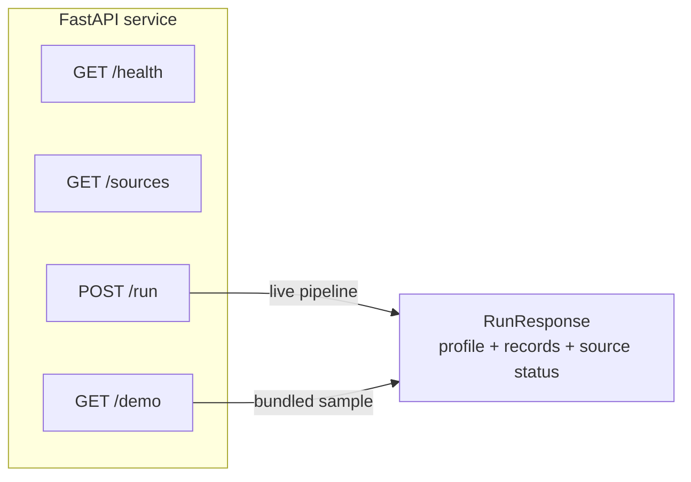

| Method | Path | Returns |
|---|---|---|
| `GET` | `/health` | service status and version |
| `GET` | `/sources` | the registered connector names |
| `POST` | `/run` | a live pipeline run for one entity |
| `GET` | `/demo` | a pre-baked result, no network required |
| `POST` | `/sector` | a full sector scan in one blocking response |
| `GET` | `/sector/stream` | the same scan as server-sent events: `resolved`, `progress`, `heartbeat`, `building`, `verifying`, `done`, `error` |
| `GET` | `/partnerships` | company + institution evidence, signals, and talking points |
| `GET` | `/directory` | search, filter, sort, and page every SEC-listed company |
| `GET` | `/directory.csv` | the filtered directory as a CSV download |
| `POST` | `/projects` | save a finished run; `GET` lists, `GET /{id}` fetches, `DELETE /{id}` removes |

```bash
curl -X POST https://dossier-api-kappa.vercel.app/run \
  -H "Content-Type: application/json" \
  -d '{"entity": "Apple", "max_results": 10}'
```

```jsonc
{
  "entity": "Apple",
  "resolved": true,
  "cik": "0000320193",
  "ticker": "AAPL",
  "profile": {
    "name": "Apple Inc.", "exchange": "Nasdaq", "industry": "Electronic Computers",
    "financials": { "revenue": { "2025": 416160000000 }, "net_income": { "2025": 112010000000 } },
    "filings": [ { "form": "10-K", "filed": "2024-11-01", "url": "https://www.sec.gov/..." } ]
  },
  "count": 18,
  "records": [ /* normalized, deduplicated, provenance-tagged */ ],
  "sources": [ { "source": "sec_edgar", "ok": true, "count": 4 } ]
}
```

---

## Reliability & security

The keyless, primary-source design shapes the threat model: there are no paid keys to leak and no model in the path. What remains is hardened.

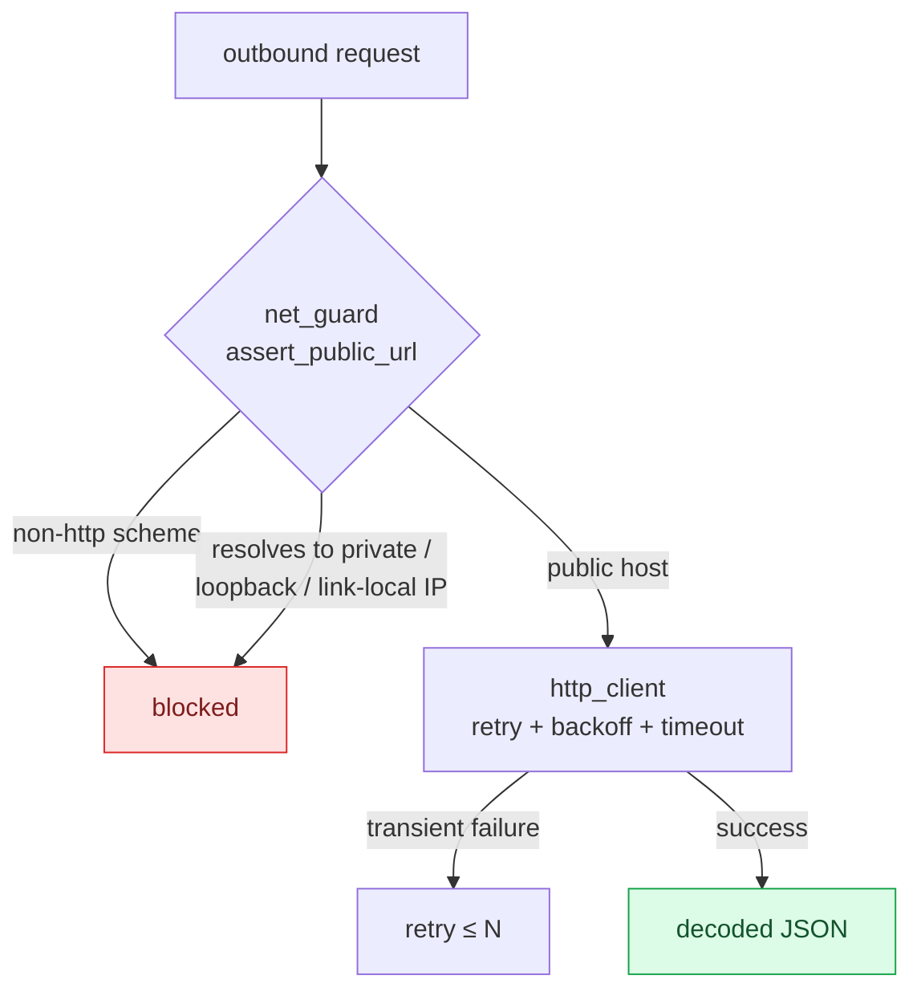

- **SSRF guard** (`net_guard.py`) - every connector targets a fixed public API, but a redirect could still point at a private, loopback, or link-local address (e.g. the cloud metadata endpoint at `169.254.169.254`). `assert_public_url` rejects non-`http(s)` schemes and any host that resolves to a non-public IP.
- **Resilient HTTP** (`http_client.py`) - a shared client with per-request timeouts and transient-failure retries with backoff. One flaky API slows a run; it never kills it.
- **Graceful degradation** - a connector that raises is recorded as a *failed source* with its error, and the rest of the dossier is built without it. The UI shows exactly which sources responded.
- **Source reputability** (`transform/validate.py`) - a record is marked *verified* only when it carries at least `min_sources` distinct provenance URLs from reputable hosts (matched by hostname suffix, not substring, so `evil-sec.gov.attacker.com` never passes as `sec.gov`).
- **Honest data mode** - the `/run` proxy stamps an `x-dossier-mode` header (`live` vs `demo`); a configured-but-unreachable backend returns 502 rather than silently serving samples as a real run.
- **Edge defenses** (`api/guard.py`) - per-client, per-route-family rate limits (the expensive sector scan gets the tightest budget: 3/min against 60/min default) answered with 429; a 16 KB request-body cap answered with 413; and strict security headers on every response (`default-src 'none'` CSP, HSTS, `nosniff`, `frame-ancestors 'none'`, `no-store`). All standard library, in-memory by design for the free single-instance deployment.
- **Rendered-link allowlist** (`frontend/lib/safeUrl.ts`) - every URL from an API payload passes an http(s)-only check with control-character rejection before it becomes a clickable link, so a poisoned upstream response can never smuggle a `javascript:` link into the page.
- **Bounded concurrency budgets** - the sector orchestrator caps its worker pool at 4 (each company already fans out to 4 connectors, keeping concurrent SEC requests polite), enforces one shared wall-clock budget, and records a company that outlives it as a failed section rather than stalling the scan.

---

## Testing

**262 Python tests on 3.10 / 3.11 / 3.12, 36 frontend unit tests under vitest, and 26 Playwright end-to-end tests covering every page - all in CI, all offline.** The pipeline is pure standard library, so the Python suite runs deterministically over recorded fixtures, including the SSE stream (asserted event by event), the 10-K narrative extractor, the Form 4 leadership parser, and the rate limiter. The e2e suite starts the app with no backend configured and walks every page as a user: searching a company, streaming a sector scan, running a partnership lookup, filtering and sorting the directory, and saving, reopening (asserting zero re-fetch), and deleting a project.

```bash
pytest                      # full backend suite
pytest tests/test_sector_orchestrator.py -v   # e.g. the sector fan-out
cd frontend && npm test     # frontend unit tests
```

Coverage spans every connector, the resolver, the profile engine (fiscal-year alignment, concept merging, restatements), dedup, validation, the HTTP client, the SSRF guard, the sector engine (membership, orchestration, report), partnerships (evidence, signals, talking points), the directory, the project store, the API edge guard, the API itself, and the CLI.

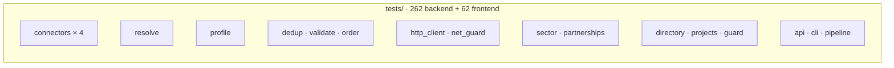

---

## Repository layout

```
src/etl_pipeline/
  resolve.py            entity resolution - typed query → company identity
  profile.py            SEC fact banner + XBRL financials + filings
  registry.py           connector registry (add a source in one line)
  models.py             Query, Record, RunResult, SourceResult
  http_client.py        retrying, timeout-bounded JSON fetcher
  net_guard.py          SSRF guard (assert_public_url)
  text.py  config.py    parsing helpers, tunable defaults
  cli.py                `dossier --entity Apple --formats json csv`
  connectors/           sec_edgar · openalex · clinicaltrials · nih_reporter
  core/                 extract (concurrent) · transform · load · pipeline
  transform/            dedup · validate · order
  load/                 json · csv · sqlite writers
  sector/               seeds · discover · membership · orchestrator · report
  partnerships/         institutions · resolver · signals · talking_points
  directory/            companies (fetch · query · csv export)
  store/                projects (sqlite save / list / fetch / delete)
  api/                  app · schemas · service · guard (FastAPI)

frontend/
  app/                  home · company/[ticker] · sectors · partnerships ·
                        directory · projects · compare, plus the /demo /run
                        /sector /partnership /companies route handlers
  components/           Charts (SVG) · AppShell (engine nav) · ui ·
                        sector/ · partnerships/ · company/ · shared/
  lib/                  api · store (shared run state) · sectorStream (SSE) ·
                        projects · safeUrl · sources · analytics · exports

api/index.py            Vercel @vercel/python entry point (re-exports FastAPI)
vercel.json             serverless function config
tests/                  34 modules, one per source module + fixtures
.github/workflows/      CI: pytest on Python 3.10-3.12 + vitest and next build
```

**Tech stack:** Next.js 14 · React 18 · TypeScript 5 · FastAPI · Python 3 (stdlib pipeline) · Vercel (both runtimes).

---

## Local development

```bash
# backend - the pipeline is pure stdlib; FastAPI only for the HTTP service
pip install -e ".[dev]"
uvicorn etl_pipeline.api.app:app --reload      # http://localhost:8000/health

# frontend - works standalone on bundled data with no backend
cd frontend
npm install
echo 'PIPELINE_API_URL=http://localhost:8000' > .env.local
npm run dev                                    # http://localhost:3000
```

Or run the pipeline straight from the command line, no server:

```bash
dossier --entity "NVIDIA" --formats json csv --out ./out
```

---

## Deployment

Two Vercel projects, both free tier.

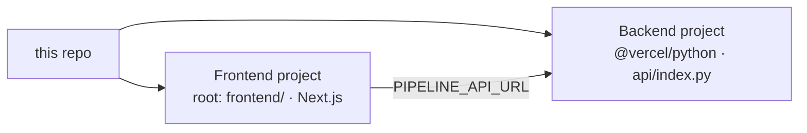

1. Deploy the backend - the repo ships `api/index.py` + `vercel.json` for the `@vercel/python` runtime.
2. Set `PIPELINE_API_URL` on the frontend project to the backend's URL. The `/run` route proxies to it server-side, so **no CORS configuration is needed**.
3. Visit `/pipeline` on the deployed site - it probes the backend's `/health` on every load and reports *Connected to a live backend*, *configured but unreachable*, or *running standalone*.

`PIPELINE_API_URL`, not `NEXT_PUBLIC_API_URL`: the former is read server-side and needs no CORS; the latter points the browser straight at the API and only works if the backend allows the origin.

---

## Design decisions

- **Resolve first, fetch second.** The one decision the whole product turns on. A keyword search across four APIs returns noise; a resolved identity returns a company.
- **No language model, anywhere.** Every number is the company's own reported figure; every narrative field is the source agency's own text. The app costs nothing to run and can't hallucinate.
- **Standard library only.** The pipeline has zero runtime dependencies - no requests, no pandas. It is trivially portable, instant to install, and impossible to break with a supply-chain update. FastAPI is pulled in only by the HTTP service.
- **The connectors are ignorant of each other.** The core dispatches through a registry; a connector is one module implementing one `fetch()`. A fifth source is a one-line registry change and a new module.
- **Degrade, never fail.** A dead API is a missing section, not a 500. The dossier is always as complete as the sources that responded, and the UI is honest about which those were.

---

## Limitations

These follow from the no-paid-APIs, no-model rule, and the UI is honest about them:

- Companies with no SEC registration (private firms, foreign issuers, research institutes) get a lighter profile - records but no financial banner.
- A company whose name is also a common noun (`Target`, `Shell`) resolves correctly against SEC, but for sources with no entity model the research match can still be loose. The SEC-resolved path is the reliable one.
- Financials are the company's own reported figures, not original analysis - the one thing a model would add, deliberately left out.
- Rate limiting is not implemented on the public endpoints; the intended deployment is a personal/free-tier project.

---

## License

MIT. See [LICENSE](LICENSE).

Data: U.S. SEC EDGAR, OpenAlex, ClinicalTrials.gov, NIH RePORTER. For information only. Not investment advice.
